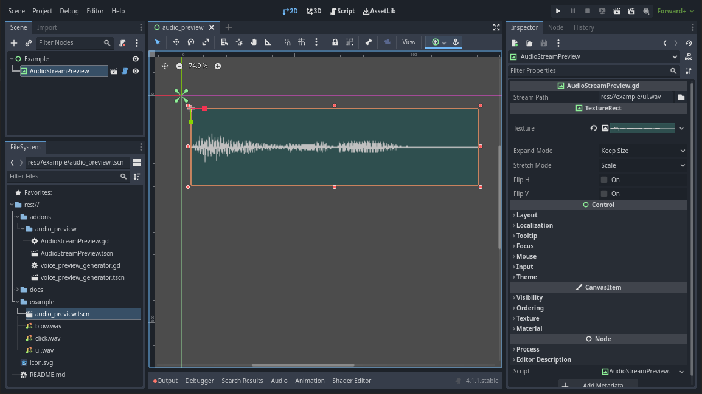

# AudioStreamPreview

Godot Plugin to show a waveform in a TextureRect. It's a `@tool` so it works even inside the editor.

Works asynchronously without using threads (so it's always thread-safe and stable), by using `await` for frames instead.

* Installation: just download the `addons/audio_preview` into your Godot 4.x project

* Usage: 
  * Drop `res://addons/audio_preview/AudioStreamPreview.tscn` into your scene
  * Set the `stream_path` property to the path for the audio file you want (must be `.wav` for now)
  * ~~Profit~~ Done.

If you find the above too complicated, check the example in `res://example/audio_preview.tscn`.

----

### Signals

The preview generation happens asynchronously, so the signals below can be used to track the process (once started it can't be aborted).

You don't have to use any signals, they are there just for convenience.

* **generation_started** -> Emitted when the preview generation process starts

* **generation_progress(normalized_progress)** -> Emitted periodically to inform about the progress (e.g. to update progress bars). The `normalized_progress` argument is what it says on the tin: a number between `0.0` and `1.0` (where `1.0` means 100%)

* **generation_completed** -> Emitted when the process is completed and the `TextureRect` is now showing the preview

